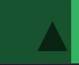

# Landing Page (Portfolio)

## [Portfolio Link](https://Portfolio.abdelaziz-elshr.repl.co)

This project is part of [Professional Web Development NanoDegree](https://egfwd.com/specializtion/web-development-professional/?utm_source=googlesearch&utm_medium=ads&utm_campaign=branding&utm_adgroup=Udacity&gclid=Cj0KCQiAnNacBhDvARIsABnDa6-vuTZmWIK4LK3uvTdPQ_sBo153HdzwvuaFkYypzU3cS3b2wWVWOYkaAmEdEALw_wcB) Provided by [Udacity](https://www.udacity.com) and Sponsored by [EGFWD](https://www.egfwd.com/)  


Note: the project was supposed to be landing page but i don't have portfolio so i thought that it's a good idea to create one through the NanoDegree path with the same rubric desired.

## Technologies Used

-HTML\
-CSS\
-Javascript\

## Installation

=> to run this project you can simply run the [index.html](index.html) file.

## Project Details

-This page developed using HTML, CSS, Javascript.

-The page is responsive across various devices (using media-query).

-The changeable content rendered to the page dynamically using DOM and that facilitates the update and the maintenance of the page e.g navbar,skills,certificates.

-Using the ```getBoundingClientRect()``` to calculate the position of the elements VS the viewport to manipulate the active section styling.

-Adding the scroll up button to the page make it easier to scroll up back.



## Resources

[Navigator.clipboard](https://developer.mozilla.org/en-US/docs/Web/API/Navigator/clipboard)\
[Window.scrollY](https://developer.mozilla.org/en-US/docs/Web/API/Window/scrollY)\
[String.prototype.match()](https://developer.mozilla.org/en-US/docs/Web/JavaScript/Reference/Global_Objects/String/match)\
[Element.getBoundingClientRect()](https://developer.mozilla.org/en-US/docs/Web/API/Element/getBoundingClientRect)\
[scrollIntoView()](https://dev.to/rohank_2502/implementing-smooth-scroll-using-javascript-28n3)
